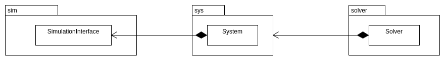
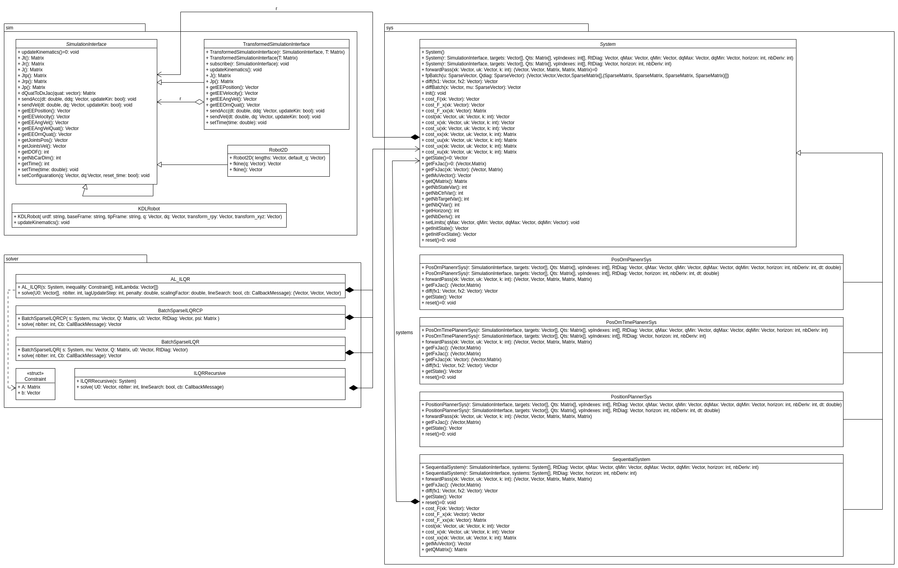

# iLQR_planner package

This package provides a C++ iLQR library that comes with its python bindings. It allows you to solve iLQR optimization problem on any robot as long as you provid an [URDF file](http://wiki.ros.org/urdf/Tutorials) describing the kinematics chain of the robot. For debugging purposes it also provide a 2D planar robots class that you can use. You can also apply a spatial transformation to compute robot task space information in the base frame of your choice (e.g. object frame).

Currently, you can optimize different kind of systems:

- Task-space position.
- Task-space position + orientation (quaternion).
- Task-space position + orientation (quaternion) + time.

It also offers you the ability to optimize multiple systems at once (by concatenating them). These systems can be either single integrator or double integrator.

The iLQR problem can be solved by these different manners:

- Recursive solution.
- AL-iLQR solution.
- Batch iLQR with control primitives (sparse computation).
- Batch iLQR (sparse computation)

## Approach of the library



To use the library you have to define 3 different objects by answering to these three questions:

### 1. Which object do I want to control?

Once you have answered this question you can create a ``SimulationInterface`` Object (either by using the ``KDLRobot`` or ``2DRobot`` class).

### 2. What do you want to track?

Once you have answered this question you can create the appropriate ``System`` object.

### 3. How do you want to optimize the problem?

Once you have answered this question you can create the appropriate ``Solver`` object.



## Structure of the repository

- ``ilqr_planner`` contains the C++ library source code.
- ``pylqr_planner`` contains the python bindings of the C++ library as well as python tutorials in ``pylqr_planner/Tutorials``.

## Dependencies

All the computations use [Eigen3](https://eigen.tuxfamily.org/index.php?title=Main_Page).

For the kinematics model of the robot, we use [KDL](https://www.orocos.org/kdl.html)

To load the URDF file and transform it into a KDL Object we use [TinyURDFParser](https://gitlab.idiap.ch/jmaceiras/tinyurdfparser), an URDF parser based on [TinyXML2](https://github.com/leethomason/tinyxml2) that does not need ROS.

Python bindings are build with the help of [pybind11](https://github.com/pybind/pybind11).

## Install

Once you managed to install all the dependencies, you can install the library by:

```bash
    $ cd <where you downloaded your package>
    $ git submodule update --init --recursive
    $ ./build.sh
```
The cmake supports three different way to install the python bindings:

- Inside a conda environment (it will automatically detect if you are using conda and install it in the active environment)
- Inside a ROS workspace, for this you can pass the parameter ``-DUSE_CATKIN=1``.
- If none of the possibilities above is available it will simply install the python package in your system directly.

* To uninstall the library, you can similarly execute the ``uninstall.sh`` file. *

## ROS Based installation

1. Make sure to clone the repository inside a ROS workspace (or move it manually).
2. Build the workspace with: ``catkin build -DUSE_CATKIN=1``.

## Documentation

### C++ documentation

No proper documentation is available at the moment. If you want to get API documention, Header files are documented.

### Python documentation

API Documentation can be generated with sphinx:

```bash
    $ cd <where you downloaded your package>/pylqr_planner/docs
    $ make html
```

After that, you can access the generated documentation by opening the ``index.html`` file in ``pylqr_planner/docs/build/html``
